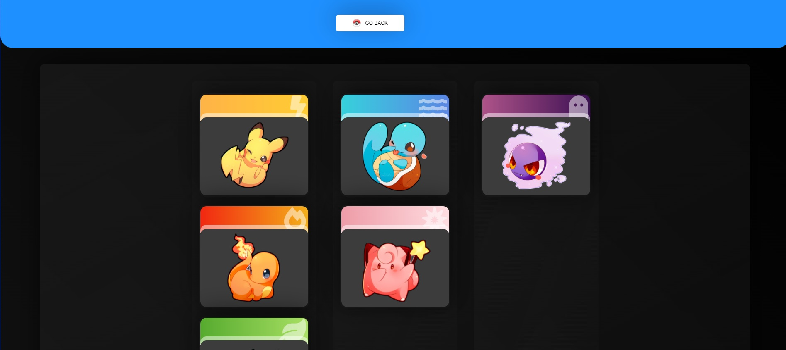

# Poke Detector
it's a very front-end oriented project to try the drag and drop functionality similar
to trello, you have a board to mount some pokemon cards and a very nice CSS design, also a sorting algorithm made in JavaScript to place and reorder the cards.
plus+ you have nice and smooth animations.
the anime images are from the artist Sevi Yummy which I preselected from free resources on the internet.

 

## Built with
- JavaScript
- react 
- react-beautiful-dnd (the react-beautiful-dnd is the library we use to make the drag and drop)
- spring (animations)
- css

## Live Demo

[Live Demo Link](https://poke-detector.netlify.app/)

## Author
### Cecilia Benitez
- 👤 [GitHub](https://github.com/Ceci007)

## Show your support
Give a ⭐️ if you like this project
